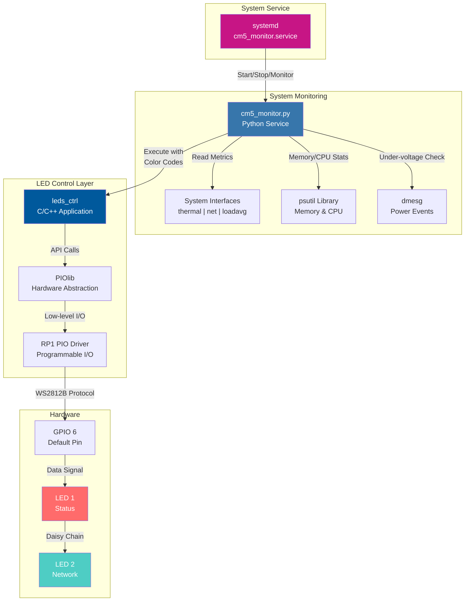

# CM5_Monitor

**System monitoring solution for Raspberry Pi Compute Module 5 with WS2812B LED status indicators**

CM5_Monitor provides real-time visual feedback of your Raspberry Pi CM5's health and network status through two addressable RGB LEDs (WS2812B). The system continuously monitors CPU load, memory usage, temperature, network connectivity, and power status, displaying this information through intuitive color-coded LEDs.

---

## 🎯 Project Goal

This project enables hands-free monitoring of Raspberry Pi Compute Module 5 systems in production environments. By using two WS2812B LEDs, you can instantly assess system health and network status without logging in or connecting a display. Perfect for:

- Server rooms and headless deployments
- Industrial automation systems
- Remote monitoring stations
- Embedded systems with limited interfaces

---

## ✨ Features

- **Dual LED Status Display**
  - **LED 1 (Status)**: System health (CPU, memory, temperature, power)
  - **LED 2 (Network)**: Network connectivity (Ethernet, WiFi, Internet)

- **Hardware-Accelerated Control**: Uses RP1 PIO (Programmable I/O) for precise WS2812B timing
- **Real-time Monitoring**: Updates every 2 seconds
- **Systemd Integration**: Runs as a background service on boot
- **Low Resource Usage**: Minimal CPU and memory footprint
- **Python-based Logic**: Easy to customize monitoring thresholds

---

## 🚦 LED Status Reference

### LED 1: System Status

| Color | Meaning | Conditions |
|-------|---------|------------|
| 🟢 **Green** | All OK | All systems nominal |
| 🟣 **Violet** | Memory Warning | RAM usage > 90% OR Swap usage > 50 MB |
| 🟠 **Orange** | High CPU Load | CPU load > 85% |
| 🔴 **Red** | Critical | CPU temp ≥ 70°C OR under-voltage detected OR system error |
| ⚫ **Off** | No data | System not initialized |

### LED 2: Network Status

| Color | Meaning | Conditions |
|-------|---------|------------|
| 🔴 **Red** | No Connection | No Ethernet, no WiFi, no Internet |
| 🟣 **Violet** | WiFi Only (No Internet) | WiFi connected, Ethernet disconnected, no Internet |
| 🟡 **Yellow** | Ethernet Only (No Internet) | Ethernet connected, WiFi disconnected, no Internet |
| 🟠 **Orange** | Both Connected (No Internet) | Both WiFi and Ethernet connected, but no Internet access |
| 🔵 **Blue** | WiFi + Internet | WiFi connected with Internet access, Ethernet disconnected |
| 🟢 **Green** | Ethernet + (wifi) + Internet | Ethernet connected with Internet access (with or without WiFi) |
| ⚪ **White** | Internet (From other Link) | Internet accessible but no physical Ethernet or WiFi carrier detected |

---

## 📋 Prerequisites

### Hardware
- Raspberry Pi Compute Module 5
- 2× WS2812B addressable RGB LEDs (or WS2812B strip with at least 2 LEDs)
- Connection to GPIO 6 (default, configurable)

### Software
- Raspberry Pi OS (Debian-based)
- CMake (version 3.10.0 or higher)
- GCC/G++ compiler
- Python 3 with `psutil` library

---

## 🔧 Installation

### 1. Install Prerequisites

```bash
# Update system
sudo apt update

# Install CMake and build tools
sudo apt install cmake build-essential

# Install Python dependencies
sudo apt install python3-psutil
```

### 2. Clone the Repository

```bash
cd ~
git clone https://github.com/Loicandre/CM5_Monitor.git
cd CM5_Monitor
```

### 3. Run the Installation Script

```bash
sudo ./install.sh
```

The installation script will:
1. Build the `leds_ctrl` C application using CMake
2. Copy binaries to `/opt/cm5_monitor/`
3. Install the systemd service
4. Enable and start the monitoring service automatically

### 4. Verify Installation

```bash
# Check service status
sudo systemctl status cm5_monitor.service

# View live logs
sudo journalctl -u cm5_monitor.service -f
```

---

## 🏗️ Architecture Overview




## 🎨 LED Color Reference (leds_ctrl)

The `leds_ctrl` utility supports the following colors (case-insensitive):

| Code | Color | RGB Values |
|------|-------|------------|
| `w` | White | Full brightness all channels |
| `x` | Off | All LEDs off |
| `r` | Red | Red only |
| `e` | Rose | Red + half Blue |
| `m` | Magenta | Red + Blue |
| `v` | Violet | Half Red + Blue |
| `b` | Blue | Blue only |
| `a` | Azure | Half Green + Blue |
| `c` | Cyan | Green + Blue |
| `s` | Spring Green | Green + half Blue |
| `g` | Green | Green only |
| `h` | Yellow-Green | Half Red + Green |
| `y` | Yellow | Red + Green |
| `o` | Orange | Red + half Green |

---

## 🛠️ Manual Control

You can manually control the LEDs using the `leds_ctrl` command:

```bash
# Set Status LED to Green, Network LED to Blue
/opt/cm5_monitor/leds_ctrl -s g -n b

# Set brightness (1-255)
/opt/cm5_monitor/leds_ctrl -s r -n g -b 100

# Use custom GPIO pin
/opt/cm5_monitor/leds_ctrl -s y -n c -g 12

# View help
/opt/cm5_monitor/leds_ctrl -h
```

### Command-Line Options

| Option | Long Form | Description | Default |
|--------|-----------|-------------|---------|
| `-h` | `--help` | Display help message | - |
| `-v` | `--verbose` | Enable verbose debug output | Off |
| `-g [gpio]` | `--gpio [gpio]` | Set GPIO pin number (0-255) | 6 |
| `-b [1-255]` | `--bright [1-255]` | Set LED brightness | 50 |
| `-s [color]` | `--stat [color]` | Set Status LED color | Off |
| `-n [color]` | `--net [color]` | Set Network LED color | Off |

---

## 📊 Monitoring Thresholds

The following thresholds trigger LED status changes:

| Metric | Threshold | Action |
|--------|-----------|--------|
| CPU Load (1 min) | > 85% | Set Status LED to Orange |
| Memory Usage | > 90% | Set Status LED to Violet |
| Swap Usage | > 50 MB | Set Status LED to Violet |
| CPU Temperature | ≥ 70°C | Set Status LED to Red |
| Under-voltage | Detected | Set Status LED to Red |

These thresholds can be customized by editing `/opt/cm5_monitor/cm5_monitor.py`.

---

## 🔄 Service Management

```bash
# Start the service
sudo systemctl start cm5_monitor.service

# Stop the service
sudo systemctl stop cm5_monitor.service

# Restart the service
sudo systemctl restart cm5_monitor.service

# Disable autostart on boot
sudo systemctl disable cm5_monitor.service

# Enable autostart on boot
sudo systemctl enable cm5_monitor.service

# View logs
sudo journalctl -u cm5_monitor.service
```

---

## 🔌 Hardware Connection

Connect your WS2812B LEDs to the Raspberry Pi CM5:

```
Raspberry Pi CM5          WS2812B LED
┌─────────────┐          ┌───────────┐
│             │          │           │
│  GPIO 6 ────┼─────────►│ DIN       │
│             │          │           │
│  GND    ────┼─────────►│ GND       │
│             │          │           │
│  5V     ────┼─────────►│ 5V        │
└─────────────┘          └───────────┘
```

**Note**: If using a different GPIO pin, specify it with the `-g` option in the service file or when calling `leds_ctrl` manually.

---

## 📁 File Structure

```
CM5_Monitor/
├── cm5_monitor.py          # Python monitoring script
├── cm5_monitor.service     # Systemd service definition
├── leds_ctrl               # Compiled C application (after build)
├── main.cpp                # C++ main application source
├── src/
│   ├── piolib.c           # PIO library implementation
│   └── pio_rp1.c          # RP1 PIO driver
├── include/               # Header files
├── install.sh             # Installation script
├── CMakeLists.txt         # CMake build configuration
├── LICENSE                # GPL-2.0 license
└── README.md              # This file
```

---

## 🐛 Troubleshooting

### LEDs not lighting up
- Check GPIO connection (default: GPIO 6)
- Verify 5V power supply to LEDs
- Ensure proper ground connection
- Check service status: `sudo systemctl status cm5_monitor.service`

### Service fails to start
```bash
# Check for errors
sudo journalctl -u cm5_monitor.service -n 50

# Verify installation
ls -la /opt/cm5_monitor/

# Test manual control
/opt/cm5_monitor/leds_ctrl -s r -n b
```

### Build errors
```bash
# Clean and rebuild
cd ~/CM5_Monitor
make clean
rm -rf CMakeCache.txt CMakeFiles
cmake .
make
```

---

## 🤝 Contributing

Contributions are welcome! Please feel free to submit issues, fork the repository, and create pull requests.

---

## 📜 License

This project is licensed under the GNU General Public License v2.0 (GPL-2.0).

See [LICENSE](LICENSE) for full details.

---

## 🙏 Acknowledgments

- Raspberry Pi Foundation for RP1 PIO libraries
- PIOlib reference implementation: https://github.com/raspberrypi/utils/tree/master/piolib
- Adafruit for WS2812B NeoPixel inspiration: https://github.com/adafruit/Adafruit_Blinka_Raspberry_Pi5_Neopixel

---

## 👤 Author

**Loic Andre** © 2025

- GitHub: [@Loicandre](https://github.com/Loicandre)
- Project Link: [https://github.com/Loicandre/CM5_Monitor](https://github.com/Loicandre/CM5_Monitor)

---

## 📸 Example Output

```
[2025-01-23 14:32:15] 🌐 Internet: Connected
[2025-01-23 14:32:15] 🔌 Ethernet: Connected
[2025-01-23 14:32:15] 📶 Wi-Fi: Disconnected
[2025-01-23 14:32:15] 🌡️ CPU Temp: 58.2°C ✅ OK
[2025-01-23 14:32:15] 🔋 Power Warning: ✅ No recent warning
[2025-01-23 14:32:15] 🧠 CPU Load (1m): 0.45 ✅ OK
[2025-01-23 14:32:15] 🧠 Memory Usage: 62.3% ✅ OK
[2025-01-23 14:32:15] 📦 Swap Used: 0.0 MB ✅ Not Used
```

---

**Enjoy your CM5 Monitor! 🎉**
